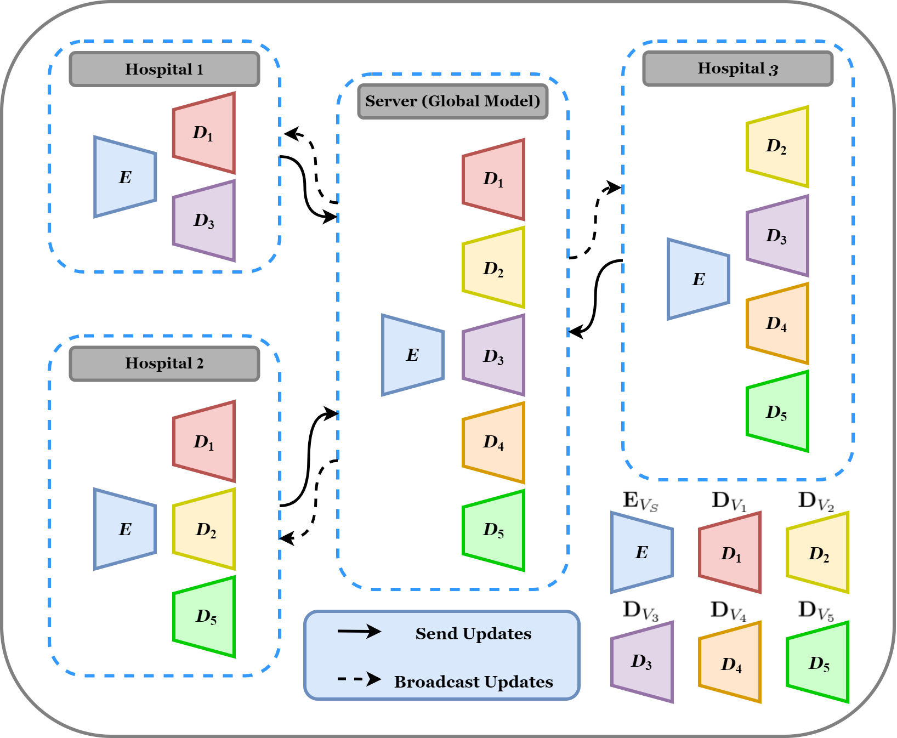

# Federated Multi-Domain GNN Network for Brain Multigraph Prediction (FMDGNN)
Please contact cxu169@gmail.com for inquiries. Thanks. 

# Introduction
This work is accepted at the MICCAI PRIME workshop 2023.


>**Federated Multimodal and Multiresolution Graph Integration for Connectional Brain Template Learning**
>
> Chun Xu and Islem Rekik
>
> BASIRA Lab, Imperial-X and Department of Computing, Imperial College London, London, UK
>
> **Abstract:** *Brain multigraph (i.e. multi-view or multi-domain) is a set of brain graphs also called brain connectomes, where each brain graph represents a unique view of pairwise relationships between brain regions (nodes) like morphology. Several works based on Graph Generative Adversarial Networks (GANs) have been recently proposed to predict brain multigraph from a single graph with the aim of early detection of anomalous changes in the human brain connectome. However, such frameworks exhibit some drawbacks. First, there is a lack of generalisability, as they did not consider the case of predicting varying domains of brain graphs from a single domain as different hospitals may have different targets. Second, they merely consider data-sharing situations and build a robust model from the cooperation of different hospitals. To overcome these limitations, we propose a Federated Multi-Domain GNN model (FMDGNN), which not only predicts multiple brain graphs with a varying number of domains from a single brain graph, but also preserves data privacy when different hospitals. Our core contributions are as follows: (i) We are the first to propose federated multi-domain GNN models for generating varying domains of brain graphs across hospitals while preserving data privacy. For instance, while hospital i can generate one domain, hospital j can generate a few domains (ii) We introduce a residual connection in the graph autoencoders to further improve the prediction performance. (iii) We propose and simplify a domain-specific GNN decoder to predict a specific brain graph domain and enhance the prediction efficiency. Our results outperform its variants, preserve data privacy and tackle statistical heterogeneity in non-IID data distribution across hospitals, thereby showing its potential in brain multigraph prediction with varying numbers of domains from a single graph. Our source code is available at https://github.com/basiralab/FMDGNN.*

## Multi-Domain Learning


## Code
This code was implemented using Python 3.9.13

## Requirements
torch = 2.0.1 + cu118 \
numpy = 1.26.1 \
networkx = 2.8.5 \
scipy = 1.11.1 \
torch_geometric = 2.3.0 \
sklearn = 1.2.1 

## Data Format
In order to use our framework, you need to provide source_target_domains lists where each element in one list is a matrix of size (n * f), representing the local data of one hospital and the number of lists represents the number of hospitals. We denote n the total number of subjects in the dataset and f the number of features. Any element of the list can be considered as the source domain and the rest are the target domains. You need to include your data in the file main.py. So, just remove our simulated training and testing dataset and replace it with yours. Then FMDGNN will be trained with your simulated dataset and it will produce the plots of the predicted results of your selected hospital.

## Components of Fed2M’s Code
| Component | Content |
| ------ | ------ |
| config.py | Includes hyperparameter and other options. You may modify it according to your needs. |
| cross_val.py | Includes the cross-validation |
| data_process.py | Includes the data processing |
| evaluate.py| Includes the way how we evaluate the model |
| fed.py| Include the federated learning settings, including Client, Server and Hospital |
| losses.py | Includes the losses used for training |
| main.py| main function |
| model.py/| Includes the GCN models|
| plot.py | Includes the methods of how we plot the results after training |
| train.py/ | Includes how we train the model  |
| utils.py/ | Includes some utility functions  |

## Paper Link
*https://link.springer.com/chapter/10.1007/978-3-031-46005-0_17*

## Citation
```latex
@inproceedings{xu2023federated,
  title={Federated Multi-domain GNN Network for Brain Multigraph Generation},
  author={Xu, Chun and Rekik, Islem},
  booktitle={International Workshop on PRedictive Intelligence In MEdicine},
  pages={194--205},
  year={2023},
  organization={Springer}
}
```
## Example Results


## License
Our code is released under MIT License (see LICENSE file for details).


